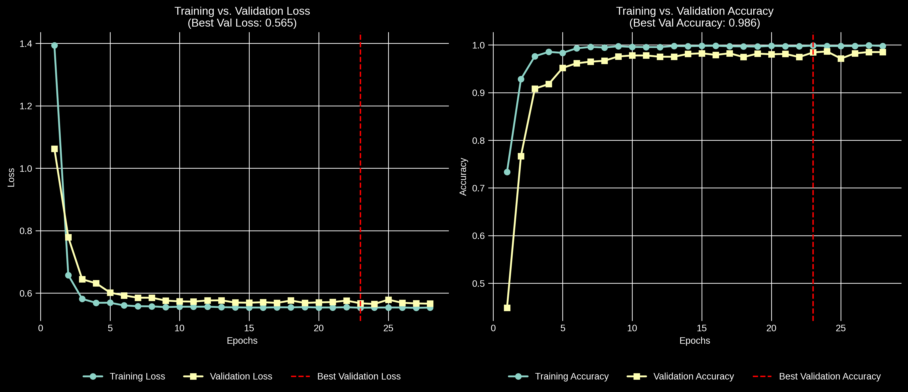

# MoE-Classifier: MoE-Gating for RAG
Infers routing decisions based on synthetic user prompts that are agentically generated by clustering each RAG-Experts knowledge base.
---

### Project Overview
This project is a component of a larger system I have been devloping to provide intelligent, course-specific responses, tailored to students by leveraging their course data, LLMS, and Deep learning.
The model architecture in broad strokes is a combination of MoE and Retreival Augmentaion where each expert is a RAG system whose knowledge base is composed of transformed multi-modal class material for a specific course.
This repository documents the development of the MoE-Classifier, a gating mechanism that routes student queries to the expert model trained on the relevant course data for their inquiry.

### Purpose
Several key challenges drove the architecture architectural decisions for this model:
1. As more knowledge bases and experts are added, the classification task grows increasingly complex.
2. The gating mechanism needs to be fast during inference to avoid bottlenecking the expert's response.
3. The system needs to scale efficiently to handle queries of varying complexity.

In response to these challenges, I decided that an "adaptive capacity" approach was needed. I chose DistilBERT as the backbone for the classifier to leverage its pretrained transformer architecture for sequence classification. 
My initial strategy involved extracting hidden states and applying an MLP to predict, on an input-by-input basis, whether to pass the hidden state’s CLS token to the classifier head or keep it within the transformer block.
This method was partially successful but lended itself to "hard-code" exits at either extreme, and additionally the input-to-input approach was quite complex to implement and evaluate.  

In response to these challenges, I shifted to the conceptual architecture presented in:  
[DACT-BERT: Differentiable Adaptive Computation Time for an Efficient BERT Inference](https://arxiv.org/abs/2109.11745)  
The architecture is similar to my initial approach, but adds a cumulative representation of the CLS token as the output, and cumulate exit confidence while operating in a batch-by-batch fasion.
 
   
### Data Generation
The dataset for this classifier consists of synthetic user queries. These queries are generated by first applying PCA to transform the vector embeddings of each RAG expert’s knowledge base. The transformed embeddings are then clustered using HDBSCAN, after which they are reverse-transformed. The extracted test metadata from the embeddings from each cluster is concatenated and batched to use as context. GPT-3.5 takes this context and is prompted to generate probable queries relating to the context generated by each cluster. In theory, since these clusters group text embeddings with high cosine similarity, the resulting context batches should correspond to course concepts. Ideally, this ensures that the generated queries cover the full scope of the course material.

The resulting synthetic queries are then labeled by their origin course name, split into train, validation and test sets for which  each synthetic query is tokenized and each label is one-hot encoded respectively. 
These splits are stored are then stored on University of Oregon's HPC cluster, Talapas. 

### Model Overview 
Dact-Bert functions by extracting the CLS token from the hidden state of each transformer layer, and passing it to a "Dact-Unit". The Dact-Unit is composed of a Linear Layer and a activation, whose output gets passed to two sub-models, one acting as an intermediate classifier, and the other as a *confidence* function. The unit combines output of the classifier with the accumulated outputs and confidences of all previous layers to reach an accumulated estimation, $a_{n}$, then in inference the model is halted when $a_{n} ≈ a_{N}$, or in broad strokes, when the layer's accumulated representation is approximately the expected final accumulated representation: 

#### Dact Unit:


The loss function used to train this model is a combination of the *Task Loss* or the cross entropy of the model's predicted expert and the true expert and the sum of the current halting state scaled by a parameter $\lambda$:  
**Loss Function** : $\hat{L} = L(x, y) + \lambda \sum_{n=1}^{N} h_{i}$  
Once the model exits the cummulated output is used to predict the the course expert.

### Training the Model  
To train the model, first I train the model backbone (Distil-Bert) with a simple classifier head consisting of a ReLU -> Dropout -> Linear Layer, then tune the hyper parameters of the model before extracting the weights just from the back bone. These weights are set as a baseline for the entire model. Then the model's two sub-model architectures are trained and tuned jointly using optuna, controlling the number of layers, hidden units, batch-normalization, and activation. Once each of these architectures are tuned, a json file of their configurations is saved.  
The configuration files and the pretrained back bone weights are used to initialize another instance of the model for which the hyper parameters are tuned excluding lambda.  
Finally a dual objective tuning round is ran, minimizing both the number of layers used as well as the task loss to find the optimal value of lambda.  
Then the model is trained for the final time with all configurations loaded, and its final configuration and weights are saved for future use.  

To do this for yourself, the DactBert class has pretrained weights for the back bone initialized already, as well as for the sub-model architectures, so just run the following lines of code:


```python
dact_model = DactBert(output_dimension=3)
train_config = {
            "split_prop": 0.3,
            "batch_size": 128,
            "reduction": "sum",
            "num_epochs": 25,
            "learning_rate": 1e-4,
            "weight_decay": 0,
                }  

lambda_reg = lambda_reg

training_engine = TrainingEngine(model=dact_model,
                                external_param_config=train_config,
                                tune_mode=False, 
                                save_model=False,
                                save_metrics=True,
                                run_tag="Example")

```

For more clarity and depth check out each scripts methods read me:  

- [BackBone Methods](Models/BackBone/back_bone.md)  

- [DactBert Model Methods](Models/DactBert/dact_bert.md)  

- [DactBert Training Methods](Models/DactBert/training_engine.md)  

- [DactBert Tuning Methods](Models/Dactbert/tuning_engine.md)


### Results
The results from running the full training and tuning pipeline:  

  


# Limitations and Interpretations of Results  
The model performs quite well, however the "Out-of-the-Box" Distil-bert performs similarily as well. There is no real surpise there as Dact-Bert is designed to improve scalability as well as inference time by exiting early when it's confident. The limitations that currently face this iteration of DactBert, are mostly the complexity of the model. It was quite difficult to build the structure I have now, with many late nights and yet there are still areas that require necessary improvement. 

## Current Potential Areas of Improvement:  
- **Lambda-Reg**: currently lambda-reg is not being saved post training & tuning pipeline meaning that results are not reproducible and limits the tunability of the model.
- **Batch-Exits**: currently I am exiting when every sample in the batch has a lower bound of confidence of it's most likely class higher than that of the runner up, meaning that if there is a  mislabeled sample or a hard question it may learn to drag through extra layers to accomadate that one sample. I'd like to replace this heursitc with some weighted average of confidences.  
- **Model-Head**: currently the accumulated output is being used to predict and I wonder if passing the accumulated output through a model head could improve the architecture.  
- **Pre-Submodel Head**: Currently the hidden state is passed directly to each Dact-Unit submodel seperately rather than being passed through a non-modular linear layer prior to being passed through the submodels. I think since the CLS token is being directly passed to the sub-model this could explain why the model determined that a 5 x 768 Neural net was the optimal architecture for the classifier sub-model.


### Future Updates
I am actively working on handling these issues as well as improving the usability of the model, so stay tuned for updates.
